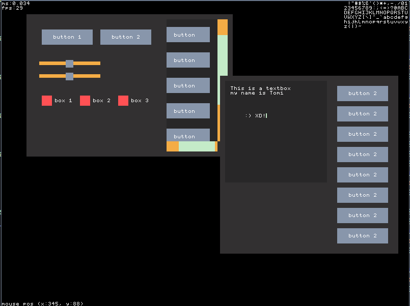

# TGUI
### A simple gui library in c
## How to use
### Create container widget
You can desing your gui using a composition of component
```c
TGuiHandle container = tgui_create_container(100, 100, 150, 200, TGUI_CONTAINER_DYNAMIC, TGUI_LAYOUT_VERTICAL, true, 5);
tgui_widget_to_root(container);

TGuiHandle button1 = tgui_create_button("button 1");
TGuiHandle button2 = tgui_create_button("button 2");

tgui_container_add_widget(container, button1);
tgui_container_add_widget(container, button2);
```
### render widget
The library is rendering agnostic and just give the user a buffer with draw commands
```c
TGuiDrawCommand draw_cmd;
while(tgui_pull_draw_command(&draw_cmd))
{
    switch(draw_cmd.type)
    {
        case TGUI_DRAWCMD_CLEAR:
        {
            // user draw code
        } break;
        case TGUI_DRAWCMD_START_CLIPPING:
        {
            // user draw code
        } break;
        case TGUI_DRAWCMD_END_CLIPPING:
        {
            // user draw code
        } break;
        case TGUI_DRAWCMD_RECT:
        {
            // user draw code
        } break;
        case TGUI_DRAWCMD_ROUNDED_RECT:
        {
            // user draw code
        } break;
        case TGUI_DRAWCMD_BITMAP:
        {
            // user draw code
        } break;
        case TGUI_DRAWCMD_CHAR:
        {
            // user draw code
        } break;
        case TGUI_DRAWCMD_TEXT:
        {
        } break;
    }
}
```
## Screenshot



